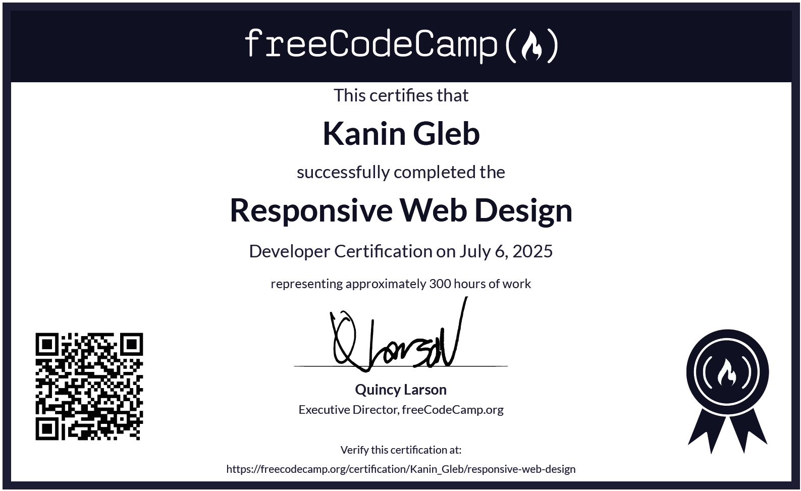
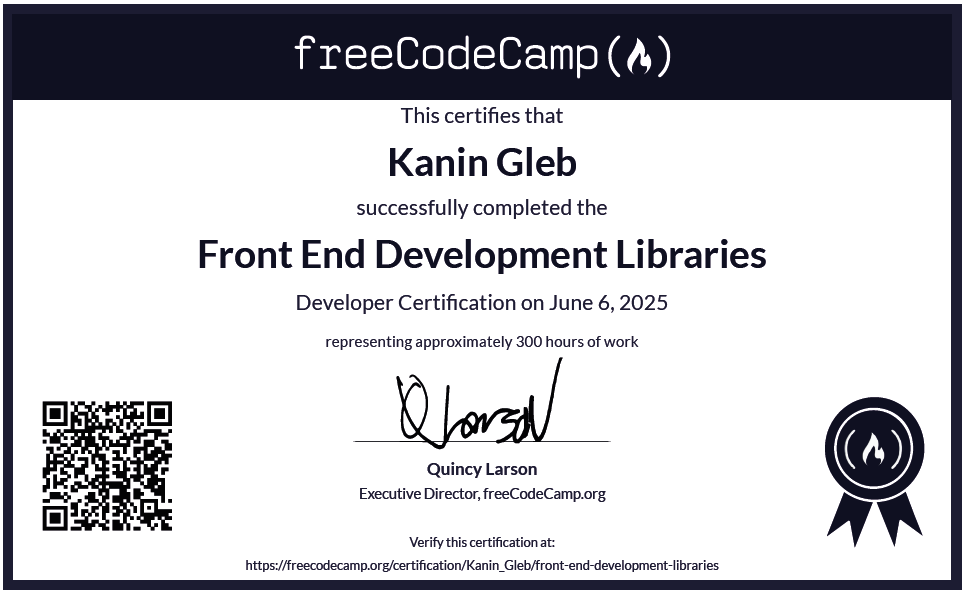

# :tada: FreeCodeCamp Projects

Welcome to my repository dedicated to completing tasks on FreeCodeCamp and earning certifications! Here you'll find various projects showcasing my skills in HTML, CSS, and JavaScript.

## :link: Project Links:

<!-- HTML & CSS -->

   <h3>:globe_with_meridians: $\textsf{\color{#ffcc00}{HTML and CSS Projects}}$</h3>

   

      <h4>:trophy: View Certificate</h3>
   

   
     
   ### 📥 Download the Responsive Web Design Certificate - [Click here to download](assets/certificates/Responsive-Web-Design/Responsive-Web-Design.pdf)
    

   
1. **Cat Photo App**  
   [View Project](https://kaningleb.github.io/FreeCodeCamp-Certification/01-Responsive-Web-Design/Part-1/01-Cat-Photo-App)

2. **Cafe Menu**  
   [View Project](https://kaningleb.github.io/FreeCodeCamp-Certification/01-Responsive-Web-Design/Part-1/02-Cafe-Menu)

3. **Set of Colored Markers**  
   [View Project](https://kaningleb.github.io/FreeCodeCamp-Certification/01-Responsive-Web-Design/Part-1/03-Set-of-Colored-Markers)

4. **Registration Form**  
   [View Project](https://kaningleb.github.io/FreeCodeCamp-Certification/01-Responsive-Web-Design/Part-1/04-Registration-Form)

5. **Survey Form** - $${\color{lightgreen}✨Certification \space project✨}$$  
   [View Project](https://kaningleb.github.io/FreeCodeCamp-Certification/01-Responsive-Web-Design/Part-1/05-Survey-form-Certification-Project/) 

6. **Rothko Painting**  
   [View Project](https://kaningleb.github.io/FreeCodeCamp-Certification/01-Responsive-Web-Design/Part-2/01-Rothko-Painting/)

7. **Photo Gallery**  
   [View Project](https://kaningleb.github.io/FreeCodeCamp-Certification/01-Responsive-Web-Design/Part-2/02-Photo-Gallery/)
   
8. **Nutrition Label**  
   [View Project](https://kaningleb.github.io/FreeCodeCamp-Certification/01-Responsive-Web-Design/Part-2/03-Nutrition-Label/)

9. **Quiz**  
   [View Project](https://kaningleb.github.io/FreeCodeCamp-Certification/01-Responsive-Web-Design/Part-2/04-Quiz/)

10. **Martin Fowler's - Tribute Page** - $${\color{lightgreen}✨Certification \space project✨}$$  
   [View Project](https://kaningleb.github.io/FreeCodeCamp-Certification/01-Responsive-Web-Design/Part-2/05-Tribute-Page/)

11. **Balance Sheet**  
   [View Project](https://kaningleb.github.io/FreeCodeCamp-Certification/01-Responsive-Web-Design/Part-3/01-Balance-Sheet/)

12. **Cat Painting**  
   [View Project](https://kaningleb.github.io/FreeCodeCamp-Certification/01-Responsive-Web-Design/Part-3/02-Cat-Painting/)

13. **Piano**  
   [View Project](https://kaningleb.github.io/FreeCodeCamp-Certification/01-Responsive-Web-Design/Part-3/03-Piano/)

14. **Technical Documentation Page** - $${\color{lightgreen}✨Certification \space project✨}$$  
   [View Project](https://kaningleb.github.io/FreeCodeCamp-Certification/01-Responsive-Web-Design/Part-3/04-Technical-Documentation-Page/)

15. **City Skyline**  
   [View Project](https://kaningleb.github.io/FreeCodeCamp-Certification/01-Responsive-Web-Design/Part-4/01-City-Skyline/)

16. **Magazine Page**  
   [View Project](https://kaningleb.github.io/FreeCodeCamp-Certification/01-Responsive-Web-Design/Part-4/02-Magazine-Page/)

17. **Product Landing Page** - $${\color{lightgreen}✨Certification \space project✨}$$  
   [View Project](https://kaningleb.github.io/FreeCodeCamp-Certification/01-Responsive-Web-Design/Part-4/03-Product-Landing-Page/)

18. **Ferris Wheel**  
   [View Project](https://kaningleb.github.io/FreeCodeCamp-Certification/01-Responsive-Web-Design/Part-5/01-Ferris-Wheel/)

19. **Penguin**  
   [View Project](https://kaningleb.github.io/FreeCodeCamp-Certification/01-Responsive-Web-Design/Part-5/02-Penguin/)

20. **Portfolio Webpage** - $${\color{lightgreen}✨Certification \space project✨}$$  
   [View Project](https://kaningleb.github.io/FreeCodeCamp-Certification/01-Responsive-Web-Design/Part-5/03-Portfolio-Webpage/) / [View my current Portfolio](https://super-portfolio-tau.vercel.app/#/) 

<!-- JavaScript -->

   <h3>:computer: $\textsf{\color{#ffcc00}{JavaScript Projects}}$</h3>

1. **Pyramid Generator**  
   [View Project](https://kaningleb.github.io/FreeCodeCamp-Certification/02-JavaScript-Algorithms-and-Data-Structures/Part-1/01-Pyramid-Generator)

2. **Gradebook App**  
   [View Project](https://kaningleb.github.io/FreeCodeCamp-Certification/02-JavaScript-Algorithms-and-Data-Structures/Part-1/02-Gradebook-App)

3. **Role Playing Game**  
   [View Project](https://kaningleb.github.io/FreeCodeCamp-Certification/02-JavaScript-Algorithms-and-Data-Structures/Part-1/03-Role-Playing-Game)

4. **Random Background Color Changer**  
   [View Project](https://kaningleb.github.io/FreeCodeCamp-Certification/02-JavaScript-Algorithms-and-Data-Structures/Part-1/04-Random-Background-Color-Changer)

5. **Calorie Counter**  
   [View Project](https://kaningleb.github.io/FreeCodeCamp-Certification/02-JavaScript-Algorithms-and-Data-Structures/Part-1/05-Calorie-Counter)

6. **Rock, Paper, Scissors Game**  
   [View Project](https://kaningleb.github.io/FreeCodeCamp-Certification/02-JavaScript-Algorithms-and-Data-Structures/Part-1/06-Rock-Paper-Scissors-Game)
   

<!-- Front End Development Libraries -->

   <h3>:atom_symbol: $\textsf{\color{#ffcc00}{Front End Development Libraries}}$</h3>

   

      <h4>:trophy: View Certificate</h3>
   

   
     
   ### 📥 Download the Front End Development Libraries Certificate - [Click here to download](assets/certificates/Front-End-Development-Libraries/Front-End-Development-Libraries.pdf)
    

1. **Cat Photo App - with Bootstrap**  
   [View Project](https://kaningleb.github.io/FreeCodeCamp-Certification/03-Front-End-Development-Libraries/01-Bootstrap/01-CatPhotoApp)

2. **jQuery Playground**  
   [View Project](https://kaningleb.github.io/FreeCodeCamp-Certification/03-Front-End-Development-Libraries/02-jQuery/01-jQuery-Playground)

3. **Syntactically Awesome StyleSheets trainings - with SASS**  
   [View Project](https://kaningleb.github.io/FreeCodeCamp-Certification/03-Front-End-Development-Libraries/03-SASS/SASS-Trainings)

4. **Class based React Trainings**  
   [View Code](https://github.com/KaninGleb/FreeCodeCamp-Certification/tree/main/03-Front-End-Development-Libraries/04-Class-based-React-and-Redux/src/Class-based-React-Trainings)

5. **Redux Trainings**  
   [View Code](https://github.com/KaninGleb/FreeCodeCamp-Certification/tree/main/03-Front-End-Development-Libraries/04-Class-based-React-and-Redux/src/Redux-Trainings)

6. **Random Quote Machine** - $${\color{lightgreen}✨Certification \space project✨}$$  
   [View Project](https://random-quote-machine-lovat-mu.vercel.app/) / [View Repository](https://github.com/KaninGleb/Random-Quote-Machine)

7. **Markdown Previewer** - $${\color{lightgreen}✨Certification \space project✨}$$  
   [View Project](https://markdown-previewer-ebon-tau.vercel.app/) / [View Repository](https://github.com/KaninGleb/Markdown-Previewer)

8. **Drum Machine** - $${\color{lightgreen}✨Certification \space project✨}$$  
   [View Project](https://drum-machine-flax-three.vercel.app/) / [View Repository](https://github.com/KaninGleb/Drum-Machine)

9. **Calculator** - $${\color{lightgreen}✨Certification \space project✨}$$  
   [View Project](https://calculator-on-react-five.vercel.app/) / [View Repository](https://github.com/KaninGleb/Calculator-on-React)

10. **Pomodoro Clock** - $${\color{lightgreen}✨Certification \space project✨}$$  
   [View Project](https://25-plus-5-clock-chi.vercel.app/) / [View Repository](https://github.com/KaninGleb/Pomodoro-Clock)
   

<!-- Data Visualization -->

   <h3>:bar_chart: $\textsf{\color{#ffcc00}{Data Visualization Projects}}$</h3>

   

   

      <h4>:trophy: View Certificate</h3>
   

   
     
   ### 📥 Download the Data Visualization Certificate - [Click here to download](assets/certificates/Data-Visualization/Data-Visualization.pdf)
    

   
1. **Visualize Data with a Bar Chart** - $${\color{lightgreen}✨Certification \space project✨}$$  
   [View Project](https://kaningleb.github.io/FreeCodeCamp-Certification/04-Data-Visualization-Projects/01-Visualize-Data-with-a-Bar-Chart)

2. **Visualize Data with a Scatterplot Graph** - $${\color{lightgreen}✨Certification \space project✨}$$  
   [View Project](https://kaningleb.github.io/FreeCodeCamp-Certification/04-Data-Visualization-Projects/02-Visualize-Data-with-a-Scatterplot-Graph)

3. **Visualize Data with a Heat Map** - $${\color{lightgreen}✨Certification \space project✨}$$  
   [View Project](https://kaningleb.github.io/FreeCodeCamp-Certification/04-Data-Visualization-Projects/03-Visualize-Data-with-a-Heat-Map)

4. **Visualize Data with a Choropleth Map** - $${\color{lightgreen}✨Certification \space project✨}$$  
   [View Project](https://kaningleb.github.io/FreeCodeCamp-Certification/04-Data-Visualization-Projects/04-Visualize-Data-with-a-Choropleth-Map)

5. **Visualize Data with a Treemap Diagram** - $${\color{lightgreen}✨Certification \space project✨}$$  
   [View Project](https://kaningleb.github.io/FreeCodeCamp-Certification/04-Data-Visualization-Projects/05-Visualize-Data-with-a-Treemap-Diagram)
   

<!-- Description -->
### :books: Description
This repository showcases my learning journey through FreeCodeCamp, featuring a variety of projects that highlight different facets of web development. Each project emphasizes essential skills, from crafting responsive layouts with HTML and CSS to implementing dynamic interactivity with JavaScript. Dive in to explore how I've developed my abilities and gained practical experience in creating functional and visually appealing web applications.

<!-- <h3>:globe_with_meridians: $\textsf{\color{#ffcc00}{Example}}$</h3> -->
<!-- **Example** - $${\color{lightgreen}✨Example \space Example✨}$$   -->

<!-- Colors: -->
<!-- #ffcc00 -->
<!-- lightgreen -->

<!-- HTML & CSS -->
<!-- 

   <h3>:globe_with_meridians: HTML and CSS Projects</h3>

   
1. **Cat Photo App**  
   [View Project](https://kaningleb.github.io/FreeCodeCamp-Certification/01-Responsive-Web-Design/Part-1/01-Cat-Photo-App)

2. **Cafe Menu**  
   [View Project](https://kaningleb.github.io/FreeCodeCamp-Certification/01-Responsive-Web-Design/Part-1/02-Cafe-Menu)

3. **Set of Colored Markers**  
   [View Project](https://kaningleb.github.io/FreeCodeCamp-Certification/01-Responsive-Web-Design/Part-1/03-Set-of-Colored-Markers)

4. **Registration Form**  
   [View Project](https://kaningleb.github.io/FreeCodeCamp-Certification/01-Responsive-Web-Design/Part-1/04-Registration-Form)

5. **Survey Form** - $${✨Certification \space project✨}$$  
   [View Project](https://kaningleb.github.io/FreeCodeCamp-Certification/01-Responsive-Web-Design/Part-1/05-Survey-form-Certification-Project/) 

6. **Rothko Painting**  
   [View Project](https://kaningleb.github.io/FreeCodeCamp-Certification/01-Responsive-Web-Design/Part-2/01-Rothko-Painting/)

7. **Photo Gallery**  
   [View Project](https://kaningleb.github.io/FreeCodeCamp-Certification/01-Responsive-Web-Design/Part-2/02-Photo-Gallery/)
   
8. **Nutrition Label**  
   [View Project](https://kaningleb.github.io/FreeCodeCamp-Certification/01-Responsive-Web-Design/Part-2/03-Nutrition-Label/)

9. **Quiz**  
   [View Project](https://kaningleb.github.io/FreeCodeCamp-Certification/01-Responsive-Web-Design/Part-2/04-Quiz/)

-->

<!-- JavaScript -->
<!-- 

   <h3>:computer: JavaScript Projects</h3>

1. **Pyramid Generator**  
   [View Project](https://kaningleb.github.io/FreeCodeCamp-Certification/02-JavaScript-Algorithms-and-Data-Structures/Part-1/01-Building-a-Pyramid-Generator)

2. **Gradebook App**  
   [View Project](https://kaningleb.github.io/FreeCodeCamp-Certification/02-JavaScript-Algorithms-and-Data-Structures/Part-1/02-Building-a-Gradebook-App)

4. **Random Background Color Changer**  
   [View Project](https://kaningleb.github.io/FreeCodeCamp-Certification/02-JavaScript-Algorithms-and-Data-Structures/Part-1/04-Debugging-by-Building-a-Random-Background-Color-Changer)

6. **Rock, Paper, Scissors Game**  
   [View Project](https://kaningleb.github.io/FreeCodeCamp-Certification/02-JavaScript-Algorithms-and-Data-Structures/Part-1/06-Building-a-Rock-Paper-Scissors-Game)
   

-->

<!-- Front End Development Libraries -->
<!--

   <h3>:atom_symbol: Front End Development Libraries</h3>

1. **Cat Photo App - with Bootstrap**  
   [View Project](https://kaningleb.github.io/FreeCodeCamp-Certification/03-Front-End-Development-Libraries/01-Bootstrap/01-CatPhotoApp)

2. **jQuery Playground**  
   [View Project](https://kaningleb.github.io/FreeCodeCamp-Certification/03-Front-End-Development-Libraries/02-jQuery/01-jQuery-Playground)

3. **Syntactically Awesome StyleSheets trainings - with SASS**  
   [View Project](https://kaningleb.github.io/FreeCodeCamp-Certification/03-Front-End-Development-Libraries/03-SASS/SASS-Trainings)

4. **Class based React Trainings**  
   [View Code](https://github.com/KaninGleb/FreeCodeCamp-Certification/tree/main/03-Front-End-Development-Libraries/04-Class-based-React-and-Redux/src/Class-based-React-Trainings)

5. **Redux Trainings**  
   [View Code](https://github.com/KaninGleb/FreeCodeCamp-Certification/tree/main/03-Front-End-Development-Libraries/04-Class-based-React-and-Redux/src/Redux-Trainings)

6. **Random Quote Machine** - $${✨Certification \space project✨}$$  
   [View Project](https://random-quote-machine-lovat-mu.vercel.app/) / [View Repository](https://github.com/KaninGleb/Random-Quote-Machine)

7. **Markdown Previewer** - $${✨Certification \space project✨}$$  
   [View Project](https://markdown-previewer-ebon-tau.vercel.app/) / [View Repository](https://github.com/KaninGleb/Markdown-Previewer)

8. **Drum Machine** - $${✨Certification \space project✨}$$  
   [View Project](https://drum-machine-flax-three.vercel.app/) / [View Repository](https://github.com/KaninGleb/Drum-Machine)

9. **Calculator** - $${✨Certification \space project✨}$$  
   [View Project](https://calculator-on-react-five.vercel.app/) / [View Repository](https://github.com/KaninGleb/Calculator-on-React)

10. **Pomodoro Clock** - $${✨Certification \space project✨}$$  
   [View Project](https://25-plus-5-clock-chi.vercel.app/) / [View Repository](https://github.com/KaninGleb/Pomodoro-Clock)
   

-->

<!-- Data Visualization -->
<!--

   <h3>:bar_chart: Data Visualization Projects</h3>

   

   

      <h4>:trophy: View Certificate</h3>
   

   
     
   ### 📥 Download the Visualization Certificate - [Click here to download](./assets/certificates/Data-Visualization/Data-Visualization.pdf)
    

   
1. **Visualize Data with a Bar Chart** - $${✨Certification \space project✨}$$  
   [View Project](https://kaningleb.github.io/FreeCodeCamp-Certification/04-Data-Visualization-Projects/01-Visualize-Data-with-a-Bar-Chart)

2. **Visualize Data with a Scatterplot Graph** - $${✨Certification \space project✨}$$  
   [View Project](https://kaningleb.github.io/FreeCodeCamp-Certification/04-Data-Visualization-Projects/02-Visualize-Data-with-a-Scatterplot-Graph)

3. **Visualize Data with a Heat Map** - $${✨Certification \space project✨}$$  
   [View Project](https://kaningleb.github.io/FreeCodeCamp-Certification/04-Data-Visualization-Projects/03-Visualize-Data-with-a-Heat-Map)

4. **Visualize Data with a Choropleth Map** - $${✨Certification \space project✨}$$  
   [View Project](https://kaningleb.github.io/FreeCodeCamp-Certification/04-Data-Visualization-Projects/04-Visualize-Data-with-a-Choropleth-Map)

5. **Visualize Data with a Treemap Diagram** - $${✨Certification \space project✨}$$  
   [View Project](https://kaningleb.github.io/FreeCodeCamp-Certification/04-Data-Visualization-Projects/05-Visualize-Data-with-a-Treemap-Diagram)
   

-->
